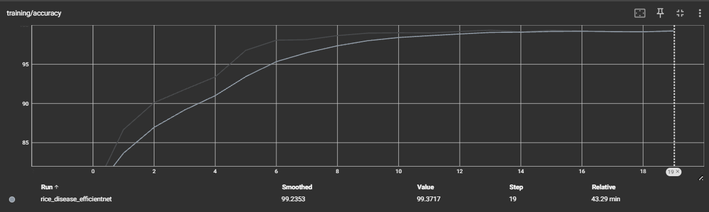
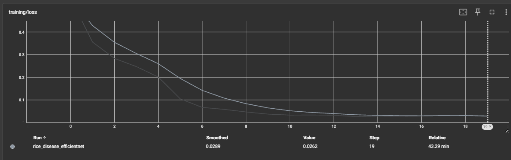
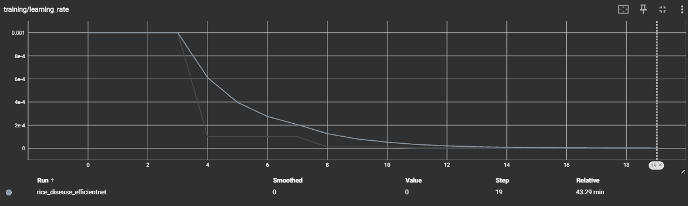

# 🌾 Rice Disease Classification

## Project Evolution
This project has evolved through two major phases, improving classification accuracy of rice crop diseases using deep learning techniques.

### Phase 1: ResNet50 Implementation
The initial implementation utilized transfer learning with ResNet50 architecture:
- **Accuracy:** Achieved 79% classification accuracy
- **Training Details:**
  - Hardware: Tesla T4 GPU
  - Loss Function: CrossEntropy Loss
  - Optimizer: Adam
  - Training Epochs: 50
- **Limitations:** While functional, accuracy levels were insufficient for reliable field application

### Phase 2: EfficientNet-B3 Implementation
A significant improvement was achieved by switching to EfficientNet-B3 and using an augmented dataset:
- **Accuracy:** Improved to 94.30%
- **Dataset:** Enhanced with augmented samples from the original dataset
- **Dataset Source:** [Augmented Dataset](https://huggingface.co/datasets/Subh775/Rice-Disease-Augmented)

- Here's the original and augmented rows details:
- 
<table border="1">
  <tr>
    <th>Dataset</th>
    <th>Before</th>
    <th>After</th>
  </tr>
  <tr>
    <td><b>changes</b></td>
    <td></td>
    <td></td>
  </tr>
</table>

## 🌿 Disease Classification
The model classifies rice crop images into four categories:

| Disease | Description |
|---------|-------------|
| **Brown Spot** | Fungal disease characterized by brown oval-shaped spots on leaves |
| **Leaf Blast** | Lesions caused by the fungus *Magnaporthe oryzae* on leaves |
| **Neck Blast** | Lesions affecting the panicle neck, caused by the same fungus as leaf blast |
| **Healthy** | Rice plants without visible disease symptoms |

## 📊 Training Visualization
<table>
  <tr>
    <td align="center">
      <strong>Model Accuracy</strong><br>
      
    </td>
    <td align="center">
      <strong>Training Loss</strong><br>
      
    </td>
    <td align="center">
      <strong>Learning Rate Progression</strong><br>
      
    </td>
  </tr>
</table>

*Figure: Model performance metrics during training*

## 📚 Resources
- **Original Dataset:** [Rice Disease Classification Dataset](https://huggingface.co/datasets/Subh775/Rice-Disease-Classification)
- **Augmented Dataset:** [Rice Disease Augmented Dataset](https://huggingface.co/datasets/Subh775/Rice-Disease-Augmented)

## 🔒 License
This project is licensed under the **Apache License 2.0** .

```
Apache License 2.0
Licensed under the Apache License, Version 2.0 (the "License");
You may not use this file except in compliance with the License.
You may obtain a copy of the License at
   http://www.apache.org/licenses/LICENSE-2.0
Unless required by applicable law or agreed to in writing, software
distributed under the License is distributed on an "AS IS" BASIS,
WITHOUT WARRANTIES OR CONDITIONS OF ANY KIND, either express or implied.
See the License for the specific language governing permissions and
limitations under the License.
```
